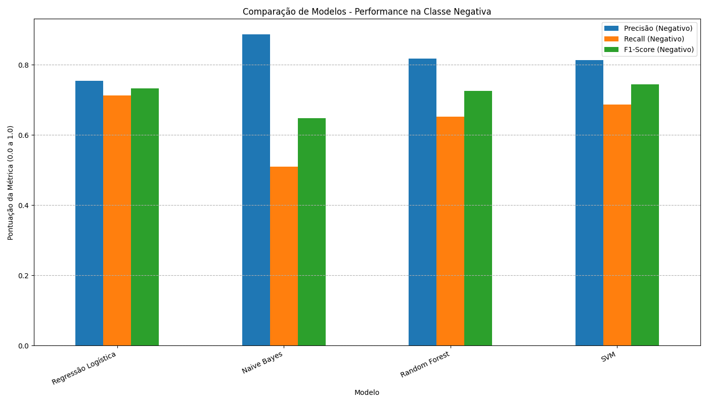

# 📊 Análise de sentimento de reviews de e-commerce

 A partir de um dataset público do Kaggle, foi construído um pipeline completo de Machine Learning, desde o pré-processamento dos dados até a análise comparativa de múltiplos modelos de classificação para determinar se uma review de produto é **positiva** ou **negativa**.

## 🛠️ Pipeline do Projeto

#### Análise Exploratória de Dados (EDA)
O primeiro passo foi explorar o conjunto de dados. A partir da abordagem top-down, foi observado o conteúdo dos arquivos .csv e o que seria significativo para o projeto. <br> <br>
Ao ser determinada como base principal, `olist_order_reviews_dataset.csv` foi utilizada para entender a distribuição das notas de avaliação (`review_score`). A partir dessa análise, foi criada a variável alvo `sentimento`:
- **Reviews Positivas:** reviews com notas 4 e 5.
- **Reviews Negativas:** reviews com notas 1 e 2.

> As reviews com nota 3 foram consideradas neutras e removidas do dataset de treino para criar um sinal de classificação mais claro e diminuir a ambiguidade para o modelo;
> No entanto, **implementações posteriores** podem considerar especificamente reviews de nota 3 e avaliar os comentários em neutros positivos e neutros negativos.

#### Pré-processamento de Texto
Para que o texto pudesse ser compreendido pelos algoritmos, foi aplicada uma série de técnicas de limpeza e normalização nos comentários das reviews:

Conversão para minúsculas; <br>
Remoção de números e sinais de pontuação; <br>
Remoção de acentos; <br>
Remoção de *stopwords* (palavras comuns como "o", "de", "que") utilizando a biblioteca NLTK (_Natural Language Tool Kit_) para o português. <br>

#### Vetorização com TF-IDF
Os textos limpos foram transformados em vetores numéricos utilizando a técnica **TF-IDF (Term Frequency-Inverse Document Frequency)**. <br> <br>
Esse método calcula a importância de cada palavra para uma review específica em relação a todas as outras reviews, permitindo que o modelo identifique as palavras que são os sinais mais fortes de sentimento positivo ou negativo. <br>
Como funciona? <br> <br>
A pontuação final de cada palavra em uma review é feita por TF * IDF <br>
Score TF-IDF = (Frequência da palavra na review) x (Raridade da palavra em todo o dataset) <br>

Exemplo: <br>
Total de reviews no dataset = 10.000 <br>
Review A: "Recebi o produto, achei **ótimo**, **ótimo** mesmo. Recomendo a todos." <br>
Review B: "A entrega do **produto** atrasou. O **produto** veio com defeito." <br>

| Métrica | Cálculo para "ótimo" (Review A) | Cálculo para "produto" (Review B) |
| :--- | :--- | :--- |
| **Frequência (TF)** | A palavra aparece **2 vezes** na review.<br>`2 / 10 = 0.2` | A palavra aparece **2 vezes** na review.<br>`2 / 10 = 0.2` |
| **Raridade (IDF)** | A palavra está em **300** de 10.000 reviews.<br>`log(10.000 / 300) ≈ 1.52` | A palavra está em **8.500** de 10.000 reviews.<br>`log(10.000 / 8.500) ≈ 0.07` |
| **Score Final (TF-IDF)** | `0.2 * 1.52 = 0.304` | `0.2 * 0.07 = 0.014` |
| **Conclusão** | **Score ALTO**<br>O modelo identifica "ótimo" como uma palavra-chave fortíssima para o sentimento. | **Score BAIXO**<br>O modelo aprende a ignorar "produto" como um indicador de sentimento. |

#### Modelagem e Otimização
Inicialmente, um modelo de **Regressão Logística** foi treinado. A análise de seus resultados mostrou um baixo **recall** para a classe negativa, indicando que o modelo não estava conseguindo identificar uma grande parte dos clientes insatisfeitos.
> E não se preocupar com o recall negativo de uma análise de _review de clientes_ significa ignorar os pontos de melhoria que os clientes estão ilustrando.

Para resolver isso, foi aplicada a técnica de **ponderação de classes** (`class_weight='balanced'`), que instrui o modelo a dar mais importância à classe minoritária (negativa) durante o treinamento. Isso resultou em uma melhora significativa no recall.
> Diminuição de **falsos positivos**, ou seja, reviews realmente negativas consideradas pelo modelo como positivas (canto superior direito) <br>
> Aumento de **falsos negativos**, ou seja, reviews positivas consideradas como negativas (canto inferior esquerdo)
>> Nota: melhor priorizar o acerto em reviews que são realmente negativas e "perder tempo" analisando reviews positivas consideradas negativas, do que nem sequer analisar algumas reviews negativas.


#### Comparação de Múltiplos Modelos
Para garantir a melhor solução, quatro modelos de classificação diferentes foram comparados:
##### Regressão Logística
> Rápido e direto, porém é baseado em apenas uma equação linear. Atribui um peso a todas as palavras da review (positivo ou negativo, 0 ou 1) e depois calcula a probabilidade da review ser positiva ou negativa no geral.
##### Naive Bayes
> Rápido, porém "ingênuo" (do inglês, _naive_). Considera a presença de uma palavra em todas as reviews (indicadas positivas ou negativas) e faz uma "aposta" para responder se a review é positiva ou negativa com base nas palavras.
##### Random Forest
> Mais robusto, decisão baseada em consenso (dificil de acontecerem erros absurdos - resiste a _overfitting_), porém mais demorado.
> _Overfitting_ ocorre quando um modelo fornece previsões precisas para dados de treinamento, mas não para novos dados.
##### Support Vector Machine (SVM)
> Ótimo para encontrar relações complexas e não-lineares, porém muito lento.

<br>

Todos os modelos foram avaliados com foco nas métricas de performance para a classe negativa (Precisão, Recall e F1-Score).

---

## 📈 Resultados e Análise

### Performance do Modelo Vencedor
A análise comparativa mostrou que, embora o SVM tenha o melhor F1-Score geral, o modelo de **Regressão Logística com `class_weight='balanced'`** apresentou o **maior Recall (0.71)** entre os modelos de alta performance. Dado que o objetivo de identificar o máximo possível de clientes insatisfeitos, este foi escolhido como o modelo final recomendado.



### Entendendo a definição de sentimento positivo e negativo
Analisando os coeficientes do modelo de Regressão Logística, foi possível extrair as palavras que mais influenciam a previsão:

**Principais palavras indicando uma review POSITIVA:**
```
antes, rapida, perfeito, excelente, lindo, amei, parabens, rapido, otimo, otima
```
* **Ideia:** A **velocidade da entrega** é o fator mais crucial para a satisfação do cliente.

**Principais palavras indicando uma review NEGATIVA:**
```
pessima, pessimo, recebi, comprei, nao, passou, baixa, aguardando, veio, ruim
```
* **Ideia:** Os problemas estão centrados na **qualidade do produto** (`pessimo`, `ruim`, `baixa`) e em **falhas na entrega ou no pedido** (`nao recebi`, `veio errado`, `faltando`).

---

## 🚀 Como Executar o Projeto

## 📄 Data Source
Os dados utilizados neste projeto são públicos e foram disponibilizados pela Olist na plataforma Kaggle. O conjunto de dados original contém informações sobre pedidos, produtos, pagamentos e, mais importante, as avaliações dos clientes, que foram a base para esta análise. <br> <br>
**Dataset:** [Brazilian E-Commerce Public Dataset by Olist](https://www.kaggle.com/datasets/olistbr/brazilian-ecommerce)

### Pré-requisitos
- Python 3.8+

### Instalação
1. Clone este repositório:
   ```bash
   git clone https://github.com/jampani1/from-data-to-feelings.git
   ```

2. Baixe os recursos necessários da NLTK (execute uma vez em um terminal Python):
   ```python
   import nltk
   nltk.download('stopwords')
   ```
### Execução
Execute todos os scripts para visualização de todo o pipeline, mas para a comparação, o principal é:
```bash
python comparison.py
```
Os gráficos de comparação serão salvos como arquivos `.png` na pasta `img/`.

---

## 🔮 Melhorias Futuras
- **Refinamento do Pré-processamento:** <br>
Testar técnicas como _Lematização_ ou _Stemming_. Além de considerar que as reviews consideram compra e pedido (palavras que aparecem mas não possuem significado para consideração de positivo/negativo).

>_Stemming_ é a retirada do sufixo das palavras para chegar ao stem (tronco); <br>
Exemplo: correndo; correu se tornam corr.

>_Lematização_ usa um dicionário para transformar o stem das palavras em uma palavra com valor gramatical; <br>
Exemplo: verbos vão para o infinitivo e subjetivos vão para o singular.


---
Este projeto foi desenvolvido por mim, Maurício J Souza, como uma demonstração de habilidades em ciência de dados e machine learning.

Para considerações, perguntas ou oportunidades, sinta-se à vontade para me encontrar em:

[](https://www.linkedin.com/in/mauriciojampani/) [](mailto:mmjampani13@gmail.com)  [](https://github.com/jampani1)
