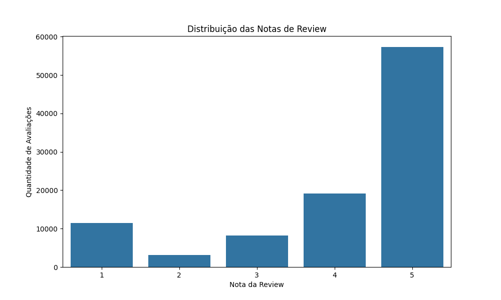
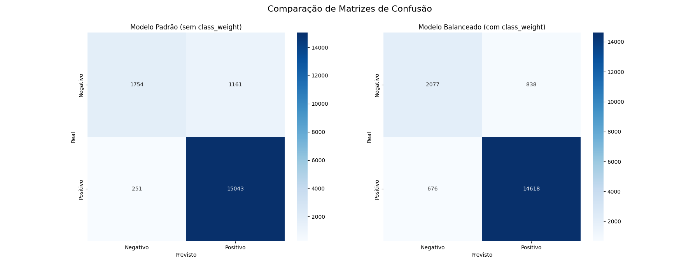
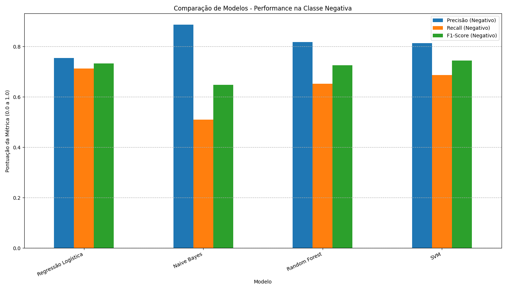

# 📊 Análise de Sentimento de Reviews de E-commerce (Desafio Olist)

 A partir de um dataset público do Kaggle, foi construído um pipeline completo de Machine Learning, desde o pré-processamento dos dados até a análise comparativa de múltiplos modelos de classificação para determinar se uma review de produto é **positiva** ou **negativa**.



---
## 🛠️ Pipeline do Projeto

### 1. Análise Exploratória e Engenharia de Features
O primeiro passo foi explorar o conjunto de dados para entender a distribuição das notas de avaliação (`review_score`). A partir dessa análise, foi criada a variável alvo `sentimento`:
- **Reviews Positivas:** reviews com notas 4 e 5.
- **Reviews Negativas:** reviews com notas 1 e 2.

- As reviews com nota 3 foram consideradas neutras e removidas do dataset de treino para criar um sinal de classificação mais claro e diminuir a ambiguidade para o modelo;
- No entanto, implementações posteriores podem considerar especificamente reviews de nota 3 e avaliar os comentários em neutros positivos e neutros negativos.

### 2. Pré-processamento de Texto
Para que o texto pudesse ser compreendido pelos algoritmos, foi aplicada uma série de técnicas de limpeza e normalização nos comentários das reviews:
- Conversão para minúsculas.
- Remoção de números e sinais de pontuação.
- Remoção de acentos.
- Remoção de *stopwords* (palavras comuns como "o", "de", "que") utilizando a biblioteca NLTK para o português.

### 3. Vetorização com TF-IDF
Os textos limpos foram transformados em vetores numéricos utilizando a técnica **TF-IDF (Term Frequency-Inverse Document Frequency)**. Esse método calcula a importância de cada palavra para uma review específica em relação a todas as outras reviews, permitindo que o modelo identifique as palavras que são os sinais mais fortes de sentimento positivo ou negativo.

### 4. Modelagem e Otimização
Inicialmente, um modelo de Regressão Logística foi treinado. A análise de seus resultados mostrou um baixo **recall** para a classe negativa, indicando que o modelo não estava conseguindo identificar uma grande parte dos clientes insatisfeitos.

Para resolver isso, foi aplicada a técnica de **ponderação de classes** (`class_weight='balanced'`), que instrui o modelo a dar mais importância à classe minoritária (negativa) durante o treinamento. Isso resultou em uma melhora significativa no recall.

### 5. Comparação de Múltiplos Modelos
Para garantir a escolha da melhor solução, foi realizado um "campeonato" entre quatro modelos de classificação diferentes:
- Regressão Logística
- Naive Bayes
- Random Forest
- Support Vector Machine (SVM)

Todos os modelos foram avaliados com foco nas métricas de performance para a classe negativa (Precisão, Recall e F1-Score).

---

## 📈 Resultados e Análise

### Performance do Modelo Vencedor
A análise comparativa mostrou que, embora o SVM tenha o melhor F1-Score geral, o modelo de **Regressão Logística com `class_weight='balanced'`** apresentou o **maior Recall (0.71)** entre os modelos de alta performance. Dado que o objetivo de identificar o máximo possível de clientes insatisfeitos, este foi escolhido como o modelo final recomendado.





### Entendendo a definição de sentimento positivo e negativo
Analisando os coeficientes do modelo de Regressão Logística, foi possível extrair as palavras que mais influenciam a previsão:

**Principais palavras indicando uma review POSITIVA:**
```
antes, rapida, perfeito, excelente, lindo, amei, parabens, rapido, otimo, otima
```
* **Insight:** A **velocidade da entrega** é o fator mais crucial para a satisfação do cliente.

**Principais palavras indicando uma review NEGATIVA:**
```
pessima, pessimo, recebi, comprei, nao, passou, baixa, aguardando, veio, ruim
```
* **Insight:** Os problemas estão centrados na **qualidade do produto** (`pessimo`, `ruim`, `baixa`) e em **falhas na entrega ou no pedido** (`nao recebi`, `veio errado`, `faltando`).

---

## 🚀 Como Executar o Projeto

### Pré-requisitos
- Python 3.8+

### Instalação
1. Clone este repositório:
   ```bash
   git clone https://github.com/jampani1/from-data-to-feelings.git
   ```

2. Baixe os recursos necessários da NLTK (execute uma vez em um terminal Python):
   ```python
   import nltk
   nltk.download('stopwords')
   ```
### Execução
Execute todos os scripts para visualização de todo o pipeline:
```bash
python data_view.py.py
python OR_db_manipulation.py
python OR_exploit.py
python final_classweightBalanced.py
python final_comparison.py
python review_classification.py
```
Os gráficos de comparação serão salvos como arquivos `.png` na pasta.

---

## 🔮 Melhorias Futuras
- **Refinamento do Pré-processamento:** Testar técnicas como Lematização ou Stemming. Além de considerar que as reviews consideram compra e pedido (palavras que aparecem mas não possuem significado para consideração de positivo/negativo)

- **Técnicas de Balanceamento:** Experimentar com oversampling (SMOTE) para comparar os resultados com o `class_weight`.

---

## 📄 Fonte dos Dados (Data Source)

Os dados utilizados neste projeto são públicos e foram disponibilizados pela Olist na plataforma Kaggle. O conjunto de dados original contém informações sobre pedidos, produtos, pagamentos e, mais importante, as avaliações dos clientes, que foram a base para esta análise.

- **Dataset:** [Brazilian E-Commerce Public Dataset by Olist](https://www.kaggle.com/datasets/olistbr/brazilian-ecommerce)

---


Este projeto foi desenvolvido por mim, Maurício J Souza, como uma demonstração de habilidades em ciência de dados e machine learning.

Para considerações, perguntas ou oportunidades, sinta-se à vontade para entrar em contato:

[](https://www.linkedin.com/in/mauriciojampani/)
[](mailto:mmjampani13@gmail.com)
[](https://github.com/jampani1)
